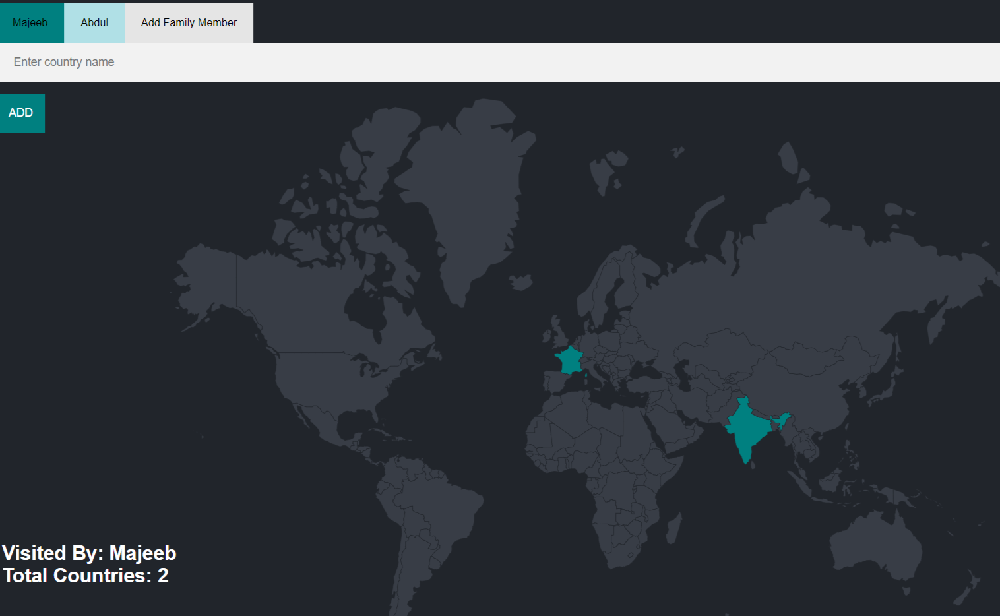
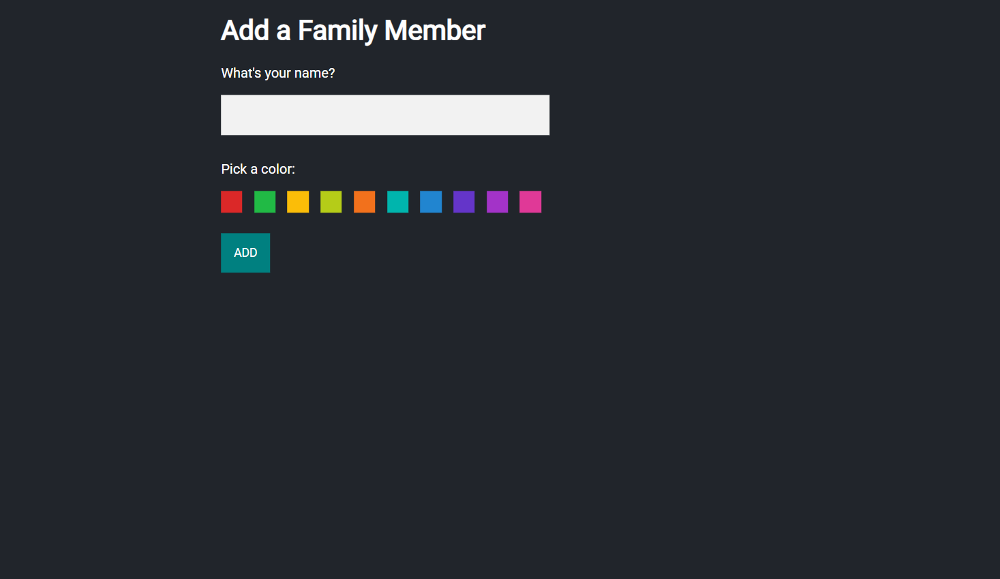

/**\*\***\***\*\*** ✨ FAMILY TRAVEL TRACKER ⭐ **\*\***\***\*\***/

# Travel Tracker

A simple web application for tracking countries visited by your LOVED_ONCE. The application is built with Node.js, Express.js, and PostgreSQL.

## Features

- User can add new family member to the application
- User can view all countries visited by all family members
- User can view all countries they have visited
- User can view the number of countries they have visited

## Technologies Used

- Node.js
- Express.js
- PostgreSQL
- EJS templating engine
- CSS for styling

## PROJECT IMAGES

User home page where user can add their visited countries and new family member to the application



Add new family member to the application



## Installation

1. Clone the repository
2. Run `npm install` to install all dependencies
3. Create a PostgreSQL database and update the db function with your database credentials
4. Populate the DB with countries.csv file by below SQL Command

   ```
   CREATE TABLE countries (
        id SERIAL PRIMARY KEY,
        country_code CHAR(2) NOT NULL,
        country_name VARCHAR(50) NOT NULL
    );


    COPY countries (id, country_code, country_name)
    FROM 'D:/path/to/your/countries.csv' -- ** replace with the path to downloaded csv file **
    DELIMITER ','
    CSV HEADER;

   ```

   or check queries.sql file for commands to create or SETUP the database

5. Run `npm run server` to start the server
6. Open a web browser and navigate to `localhost:3000` to view the application
